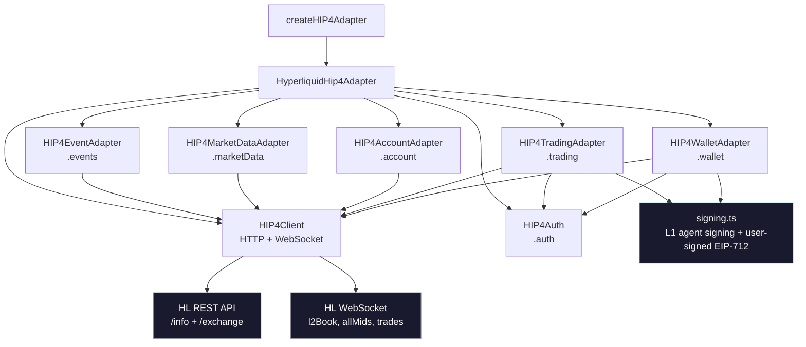

# @perps/hip4

Zero-dependency TypeScript SDK for Hyperliquid HIP-4 prediction markets.

[Open demo integration ->](https://demo.prps.app)

---

## Quick Walkthrough

### What is this

A typed adapter interface for HIP-4 prediction markets on Hyperliquid. Fetch events, stream real-time orderbook data, place and cancel orders, manage USDH deposits and withdrawals, track positions -- all client-side, zero runtime dependencies.

HIP-4 extends Hyperliquid's L1 with binary outcome markets. Each outcome has two sides (e.g. Yes/No or named alternatives like "Hypurr"/"Usain Bolt"), traded as probability tokens priced 0-1. This SDK wraps the HL REST + WebSocket API with HIP-4-specific coin naming, signing, and data mapping.

### Architecture



**Adapter pattern** -- six sub-adapters share a single `HIP4Client` that handles URL routing, retry on 5xx, and WebSocket connection management with auto-reconnect (exponential backoff, max 10 attempts).

**Two signing methods** -- the SDK implements both Hyperliquid signing flows from scratch with zero dependencies:

- **L1 agent signing** -- for orders, cancels, and USDH spot trades. MessagePack serialize (key-order-sensitive) -> append nonce as BE u64 -> keccak-256 hash -> EIP-712 sign with `Agent` type (chainId 1337). Used by the trading adapter and wallet adapter (USDH buy/sell).
- **User-signed EIP-712** -- for fund transfers, withdrawals, and sends. Standard EIP-712 on the `HyperliquidSignTransaction` domain with `signatureChainId: 0x66eee`. Used by the wallet adapter. Requires the user's actual wallet as signer.

**Outcome names** -- side names are resolved from `outcomeMeta.sideSpecs` (e.g. "Yes"/"No", "Hypurr"/"Usain Bolt") and cached permanently. All adapters share a single resolver so prices, positions, and events consistently display real names.

**Coin naming** -- `@<outcomeId>` for AMM price lookups, `#<outcomeId><sideIndex>` for tradeable instruments. Asset IDs: `100_000_000 + outcomeId * 10 + sideIndex` for HIP-4 outcomes, `10_000 + spotIndex` for spot tokens (e.g. USDH).

### API

```bash
npm install @perps/hip4
```

```typescript
import { createHIP4Adapter } from "@perps/hip4";

const hip4 = createHIP4Adapter({ testnet: true });
await hip4.initialize();
```

#### Events

```typescript
const events = await hip4.events.fetchEvents({ active: true });
const event = await hip4.events.fetchEvent("q1");
const categories = await hip4.events.fetchCategories();
```

#### Market Data

```typescript
const book = await hip4.marketData.fetchOrderBook("516", 0);    // side 0
const price = await hip4.marketData.fetchPrice("516");           // both sides, real names from sideSpecs
const trades = await hip4.marketData.fetchTrades("516", 20);
const candles = await hip4.marketData.fetchCandles("516", "1h");

// Real-time WebSocket subscriptions
const unsub = hip4.marketData.subscribeOrderBook("516", (book) => { /* ... */ });
const unsub2 = hip4.marketData.subscribePrice("516", (price) => { /* ... */ });
const unsub3 = hip4.marketData.subscribeTrades("516", (trade) => { /* ... */ });
```

#### Account

```typescript
const positions = await hip4.account.fetchPositions(address);
// positions[].outcomeName gives the resolved sideSpec name (e.g. "Hypurr")
// positions[].outcome gives the raw coin ID (e.g. "#90") for lookups

const activity = await hip4.account.fetchActivity(address);
const balances = await hip4.account.fetchBalance(address);
const orders = await hip4.account.fetchOpenOrders(address);

const unsub = hip4.account.subscribePositions(address, (positions) => { /* ... */ });
```

#### Trading

```typescript
// Auth: approve an ephemeral agent key, then all trades are signed silently
import { getAgentApprovalTypedData, submitAgentApproval } from "@perps/hip4";
import { generatePrivateKey, privateKeyToAccount } from "viem/accounts";

const agentKey = generatePrivateKey();
const agent = privateKeyToAccount(agentKey);
const typedData = getAgentApprovalTypedData(agent.address, "My App", Date.now(), false);
const sig = await walletClient.signTypedData(typedData);
await submitAgentApproval(sig, agent.address, "My App", Date.now(), false);
await hip4.auth.initAuth(userAddress, agent);

// Place order
const result = await hip4.trading.placeOrder({
  marketId: "516",
  outcome: "#5160",
  side: "buy",
  type: "limit",
  price: "0.65",
  amount: "100",
});

// Cancel order
await hip4.trading.cancelOrder({ marketId: "516", orderId: "12345", outcome: "#5160" });
```

#### Wallet

The wallet adapter handles fund management. It uses two signers:

- **User's wallet** (set via `setSigner`) for transfers and withdrawals (EIP-712 user signing)
- **Agent key** (from `auth.initAuth`) for USDH spot buy/sell (L1 agent signing)

```typescript
// Set the user's wallet for transfer/withdraw signing
hip4.wallet.setSigner({
  address: userAddress,
  signTypedData: walletClient.signTypedData.bind(walletClient),
});

// Deposit flow: Perp → Spot → buy USDH
await hip4.wallet.transferToSpot("100");    // move USDC from Perp to Spot (user-signed)
await hip4.wallet.buyUsdh("100");           // buy USDH on spot market (agent-signed)

// Withdraw flow: sell USDH → Spot → Perp → external wallet
await hip4.wallet.sellUsdh("50");           // sell USDH on spot market (agent-signed)
await hip4.wallet.transferToPerps("50");    // move USDC from Spot to Perp (user-signed)
await hip4.wallet.withdraw({               // withdraw to external address (user-signed)
  destination: "0x...",
  amount: "50",
});

// Send USDC to another HL address
await hip4.wallet.usdSend({ destination: "0x...", amount: "25" });
```

USDH spot orders fetch the oracle/mark price from `spotMetaAndAssetCtxs` and price within ±10% using `Ioc` TIF. Returns `{ success, filledSz?, avgPx? }` so you can chain the filled amount into subsequent steps (e.g. transfer the exact USDC received from a sell).

### Testing

```bash
npm test          # 289 tests across 24 files
```

Coverage includes: keccak-256 against known vectors, msgpack encoding, action sorting, L1 action hash cross-validated against @nktkas/hyperliquid, viem + ethers signer acceptance, agent approval typed data construction, all adapter mapping logic, retry behavior, WebSocket reconnection and per-coin subscription dispatch, user-signed EIP-712 action signing (domain construction, message filtering, signatureChainId validation), wallet adapter operations (signer detection, viem wrapping, USDH spot orders with oracle pricing, usdClassTransfer, withdraw, usdSend, error paths), side name resolution from outcomeMeta sideSpecs.

---

## Additional Details

### Full API Reference

#### `adapter.events` -- PredictionEventAdapter

| Method | Description |
|--------|-------------|
| `fetchEvents(params?)` | List events. Filters: `category`, `active`, `limit`, `offset`, `query` |
| `fetchEvent(eventId)` | Single event by ID (`q<n>` for questions, `o<n>` for standalone) |
| `fetchCategories()` | Returns `[{ id, name, slug }]` -- "custom" and "recurring" |

Side names from `outcomeMeta.sideSpecs` are cached on first fetch and shared across all adapters.

#### `adapter.marketData` -- PredictionMarketDataAdapter

| Method | Description |
|--------|-------------|
| `fetchOrderBook(marketId, sideIndex?)` | L2 snapshot. `sideIndex` defaults to 0 |
| `fetchPrice(marketId)` | Both sides from allMids. Outcome names resolved from sideSpecs. 5s cache |
| `fetchTrades(marketId, limit?)` | Recent trades. Default limit 50 |
| `fetchCandles(marketId, interval?, start?, end?)` | OHLCV. Default 1h interval, 14 days |
| `subscribeOrderBook(marketId, cb)` | Real-time L2 book via WebSocket |
| `subscribePrice(marketId, cb)` | Real-time prices via WebSocket allMids |
| `subscribeTrades(marketId, cb)` | Real-time trades via WebSocket |

#### `adapter.account` -- PredictionAccountAdapter

| Method | Description |
|--------|-------------|
| `fetchPositions(address)` | Spot balances filtered to outcome coins. Each position has `outcome` (coin ID) and `outcomeName` (display name from sideSpecs) |
| `fetchActivity(address)` | userFillsByTime, last 30 days, outcome coins only |
| `fetchBalance(address)` | Raw spot balances (USDH, outcome tokens) |
| `fetchOpenOrders(address)` | Resting orders (frontendOpenOrders) |
| `subscribePositions(address, cb)` | Polling at 10s (no WS channel for spot) |

#### `adapter.trading` -- PredictionTradingAdapter

| Method | Description |
|--------|-------------|
| `placeOrder(params)` | Returns `{ success, orderId?, status?, shares?, error? }`. Never throws |
| `cancelOrder(params)` | Throws on failure |

Order params: `{ marketId, outcome, side, type, price?, amount, timeInForce? }`

Market orders use `FrontendMarket` TIF with ceiling/floor pricing for best-execution. All orders are signed with L1 agent signing.

#### `adapter.auth` -- PredictionAuthAdapter

| Method | Description |
|--------|-------------|
| `initAuth(walletAddress, signer)` | Accepts viem PrivateKeyAccount or ethers Signer |
| `getAuthStatus()` | `{ status: "disconnected" | "pending_approval" | "ready", address? }` |
| `clearAuth()` | Reset to disconnected |

#### `adapter.wallet` -- PredictionWalletAdapter

| Method | Signing | Description |
|--------|---------|-------------|
| `setSigner(signer)` | -- | Set the user's wallet for EIP-712 operations. Auto-wraps viem-style objects |
| `buyUsdh(amount)` | L1 agent | Buy USDH on spot market. Prices at oracle ±10%, Ioc TIF |
| `sellUsdh(amount)` | L1 agent | Sell USDH on spot market. Prices at oracle ±10%, Ioc TIF |
| `transferToSpot(amount)` | EIP-712 | Transfer USDC from Perp → Spot (deposit into predictions) |
| `transferToPerps(amount)` | EIP-712 | Transfer USDC from Spot → Perp (withdraw from predictions) |
| `usdClassTransfer({ amount, toPerp })` | EIP-712 | Generic Spot ↔ Perp transfer |
| `withdraw({ destination, amount })` | EIP-712 | Withdraw USDC to external address (`withdraw3`) |
| `usdSend({ destination, amount })` | EIP-712 | Send USDC to another HL address |

All methods return `{ success, error?, filledSz?, avgPx? }`. USDH spot orders fetch the oracle/mark price from `spotMetaAndAssetCtxs` and price within 10% to satisfy HL's oracle distance validation. Fill data (`filledSz`, `avgPx`) is returned for spot orders so downstream flows can use the actual filled amount. EIP-712 methods use `signatureChainId: 0x66eee` and require the user's actual wallet -- agent keys will be rejected.

#### Agent Wallet Helpers

| Export | Description |
|--------|-------------|
| `getAgentApprovalTypedData(addr, name, nonce, isMainnet?)` | EIP-712 typed data for ApproveAgent |
| `submitAgentApproval(sig, addr, name, nonce, isMainnet?, url?)` | POST to HL /exchange |

### Signing Internals

#### L1 Agent Signing (orders, cancels, USDH spot trades)

Pipeline in `src/adapter/hyperliquid/signing.ts`:

1. **Sort** action keys in canonical order (type -> orders -> grouping for orders; type -> cancels for cancels). Price/size strings have trailing zeros stripped
2. **MessagePack encode** the sorted action object
3. **Append** nonce as big-endian uint64 (8 bytes)
4. **Append** vault marker (0x00 for no vault, 0x01 + 20-byte address for vault)
5. **Keccak-256** hash the concatenated bytes -> `connectionId`
6. **EIP-712 sign** with domain `{ name: "Exchange", version: "1", chainId: 1337 }`, primaryType `Agent`, message `{ source: "a"|"b", connectionId }`

The msgpack encoder and keccak-256 are implemented inline (~350 lines). Hash output is cross-validated against `@nktkas/hyperliquid` in tests.

#### User-Signed EIP-712 (transfers, withdrawals, sends)

Used for `withdraw3`, `usdClassTransfer`, `usdSend`, and other wallet-level actions. The action is signed directly as EIP-712 typed data:

- Domain: `{ name: "HyperliquidSignTransaction", version: "1", chainId: <from signatureChainId>, verifyingContract: 0x0 }`
- `signatureChainId` is always `0x66eee` (421614) per Hyperliquid convention
- `hyperliquidChain` is `"Mainnet"` or `"Testnet"` to distinguish environments
- The message is filtered to only include keys defined in the EIP-712 types (wallet compatibility)
- Invalid `signatureChainId` values are rejected with a descriptive error

### Network Configuration

| | Info | Exchange | WebSocket |
|---|---|---|---|
| **Testnet** | `api-ui.hyperliquid-testnet.xyz/info` | `api-ui.hyperliquid-testnet.xyz/exchange` | `wss://api-ui.hyperliquid-testnet.xyz/ws` |
| **Mainnet** | `api.hyperliquid.xyz/info` | `api.hyperliquid.xyz/exchange` | `wss://api.hyperliquid.xyz/ws` |

### License

BUSL-1.1
