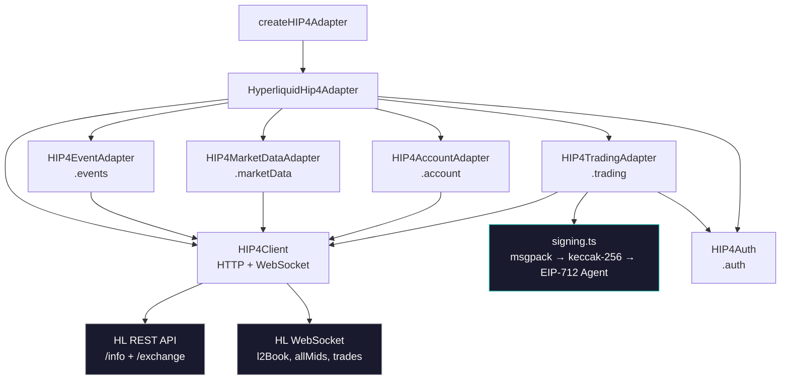

# @perps/hip4

Zero-dependency TypeScript SDK for Hyperliquid HIP-4 prediction markets.

---

## Quick Walkthrough

### What is this

A typed adapter interface for HIP-4 prediction markets on Hyperliquid. Fetch events, stream real-time orderbook data, place and cancel orders, manage positions — all client-side, zero runtime dependencies.

HIP-4 extends Hyperliquid's L1 with binary outcome markets. Each outcome has two sides (Yes/No), traded as probability tokens priced 0–1. This SDK wraps the HL REST + WebSocket API with HIP-4-specific coin naming, signing, and data mapping.

### Architecture



**Adapter pattern** — all sub-adapters share a single `HIP4Client` that handles URL routing, retry on 5xx, and WebSocket connection management with auto-reconnect (exponential backoff, max 10 attempts).

**Signing** — L1 action signing implemented from scratch: MessagePack serialize (key-order-sensitive) → append nonce as BE u64 → keccak-256 hash → EIP-712 sign with `Agent` type (chainId 1337). Zero dependencies — no ethers, no viem, no @nktkas.

**Coin naming** — `@<outcomeId>` for AMM price lookups, `#<outcomeId><sideIndex>` for tradeable instruments. Asset IDs: `100_000_000 + outcomeId * 10 + sideIndex`.

### API

```bash
npm install @perps/hip4
```

```typescript
import { createHIP4Adapter } from "@perps/hip4";

const hip4 = createHIP4Adapter({ testnet: true });
await hip4.initialize();
```

#### Events

```typescript
const events = await hip4.events.fetchEvents({ active: true });
const event = await hip4.events.fetchEvent("q1");
const categories = await hip4.events.fetchCategories();
```

#### Market Data

```typescript
const book = await hip4.marketData.fetchOrderBook("516", 0);    // side 0 = Yes
const price = await hip4.marketData.fetchPrice("516");           // both sides
const trades = await hip4.marketData.fetchTrades("516", 20);
const candles = await hip4.marketData.fetchCandles("516", "1h");

const unsub = hip4.marketData.subscribeOrderBook("516", (book) => { /* ... */ });
const unsub2 = hip4.marketData.subscribePrice("516", (price) => { /* ... */ });
```

#### Account

```typescript
const positions = await hip4.account.fetchPositions(address);
const activity = await hip4.account.fetchActivity(address);
const balances = await hip4.account.fetchBalance(address);
const orders = await hip4.account.fetchOpenOrders(address);

const unsub = hip4.account.subscribePositions(address, (positions) => { /* ... */ });
```

#### Trading

```typescript
// Auth: ephemeral agent key model
import { getAgentApprovalTypedData, submitAgentApproval } from "@perps/hip4";
import { generatePrivateKey, privateKeyToAccount } from "viem/accounts";

const agentKey = generatePrivateKey();
const agent = privateKeyToAccount(agentKey);
const typedData = getAgentApprovalTypedData(agent.address, "My App", Date.now(), false);
const sig = await walletClient.signTypedData(typedData);
await submitAgentApproval(sig, agent.address, "My App", Date.now(), false);
await hip4.auth.initAuth(userAddress, agent);

// Place order
const result = await hip4.trading.placeOrder({
  marketId: "516",
  outcome: "#5160",
  side: "buy",
  type: "limit",
  price: "0.65",
  amount: "100",
});

// Cancel order
await hip4.trading.cancelOrder({ marketId: "516", orderId: "12345", outcome: "#5160" });
```

#### React

```tsx
import { PredictionsAdapterProvider, usePredictionsAdapter } from "@perps/hip4";
import { useEvents, usePredictionBook, usePredictionPrice } from "@perps/hip4/hooks";
```

### Testing

```bash
npm test          # 175 tests across 14 files
```

Coverage includes: keccak-256 against known vectors, msgpack encoding, action sorting, L1 action hash cross-validated against @nktkas/hyperliquid, viem + ethers signer acceptance, agent approval typed data construction, all adapter mapping logic, retry behavior, WebSocket reconnection state.

---

## Additional Details

### Full API Reference

#### `adapter.events` — PredictionEventAdapter

| Method | Description |
|--------|-------------|
| `fetchEvents(params?)` | List events. Filters: `category`, `active`, `limit`, `offset`, `query` |
| `fetchEvent(eventId)` | Single event by ID (`q<n>` for questions, `o<n>` for standalone) |
| `fetchCategories()` | Returns `[{ id, name, slug }]` — "custom" and "recurring" |

#### `adapter.marketData` — PredictionMarketDataAdapter

| Method | Description |
|--------|-------------|
| `fetchOrderBook(marketId, sideIndex?)` | L2 snapshot. `sideIndex` defaults to 0 (Yes) |
| `fetchPrice(marketId)` | Both sides from allMids. 5s cache |
| `fetchTrades(marketId, limit?)` | Recent trades. Default limit 50 |
| `fetchCandles(marketId, interval?, start?, end?)` | OHLCV. Default 1h interval, 14 days |
| `subscribeOrderBook(marketId, cb)` | WebSocket l2Book channel |
| `subscribePrice(marketId, cb)` | WebSocket allMids channel |
| `subscribeTrades(marketId, cb)` | WebSocket trades channel |

#### `adapter.account` — PredictionAccountAdapter

| Method | Description |
|--------|-------------|
| `fetchPositions(address)` | From spotClearinghouseState, filtered to outcome coins |
| `fetchActivity(address)` | userFillsByTime, last 30 days, outcome coins only |
| `fetchBalance(address)` | Raw spot balances (USDH, outcome tokens) |
| `fetchOpenOrders(address)` | Resting orders (frontendOpenOrders) |
| `subscribePositions(address, cb)` | Polling at 10s (no WS channel for spot) |

#### `adapter.trading` — PredictionTradingAdapter

| Method | Description |
|--------|-------------|
| `placeOrder(params)` | Returns `{ success, orderId?, status?, shares?, error? }`. Never throws |
| `cancelOrder(params)` | Throws on failure |

Order params: `{ marketId, outcome, side, type, price?, amount, timeInForce? }`

Market orders use `FrontendMarket` TIF with ceiling/floor pricing (`0.99999`/`0.00001`) for best-execution.

#### `adapter.auth` — PredictionAuthAdapter

| Method | Description |
|--------|-------------|
| `initAuth(walletAddress, signer)` | Accepts viem PrivateKeyAccount or ethers Signer |
| `getAuthStatus()` | `{ status: "disconnected" | "pending_approval" | "ready", address? }` |
| `clearAuth()` | Reset to disconnected |

#### Agent Wallet Helpers

| Export | Description |
|--------|-------------|
| `getAgentApprovalTypedData(addr, name, nonce, isMainnet?)` | EIP-712 typed data for ApproveAgent |
| `submitAgentApproval(sig, addr, name, nonce, isMainnet?, url?)` | POST to HL /exchange |

#### React Hooks

| Hook | Returns |
|------|---------|
| `useEvents(params?)` | `{ events, isLoading, error }` |
| `useEventDetail(eventId)` | `{ event, isLoading, error }` |
| `usePredictionBook(marketId)` | `{ data: OrderBook, isLoading, error }` — WebSocket streaming |
| `usePredictionPrice(marketId)` | `{ data: Price, isLoading, error }` — WebSocket streaming |
| `usePredictionPositions(address)` | `{ data: Position[], isLoading, error }` — 10s polling |

### Signing Internals

The signing pipeline (`src/adapter/hyperliquid/signing.ts`):

1. **Sort** action keys in canonical order (type → orders → grouping for orders; type → cancels for cancels). Price/size strings have trailing zeros stripped
2. **MessagePack encode** the sorted action object
3. **Append** nonce as big-endian uint64 (8 bytes)
4. **Append** vault marker (0x00 for no vault, 0x01 + 20-byte address for vault)
5. **Keccak-256** hash the concatenated bytes → `connectionId`
6. **EIP-712 sign** with domain `{ name: "Exchange", version: "1", chainId: 1337 }`, primaryType `Agent`, message `{ source: "a"|"b", connectionId }`

The msgpack encoder and keccak-256 are implemented inline (~350 lines). Hash output is cross-validated against `@nktkas/hyperliquid` in tests.

### Network Configuration

| | Info | Exchange | WebSocket |
|---|---|---|---|
| **Testnet** | `api-ui.hyperliquid-testnet.xyz/info` | `api-ui.hyperliquid-testnet.xyz/exchange` | `wss://api-ui.hyperliquid-testnet.xyz/ws` |
| **Mainnet** | `api.hyperliquid.xyz/info` | `api.hyperliquid.xyz/exchange` | `wss://api.hyperliquid.xyz/ws` |

### Demo

[h4d](https://h4d.pages.dev) — Vite + React SPA built exclusively with this SDK.

### License

BUSL-1.1
# hip-4
